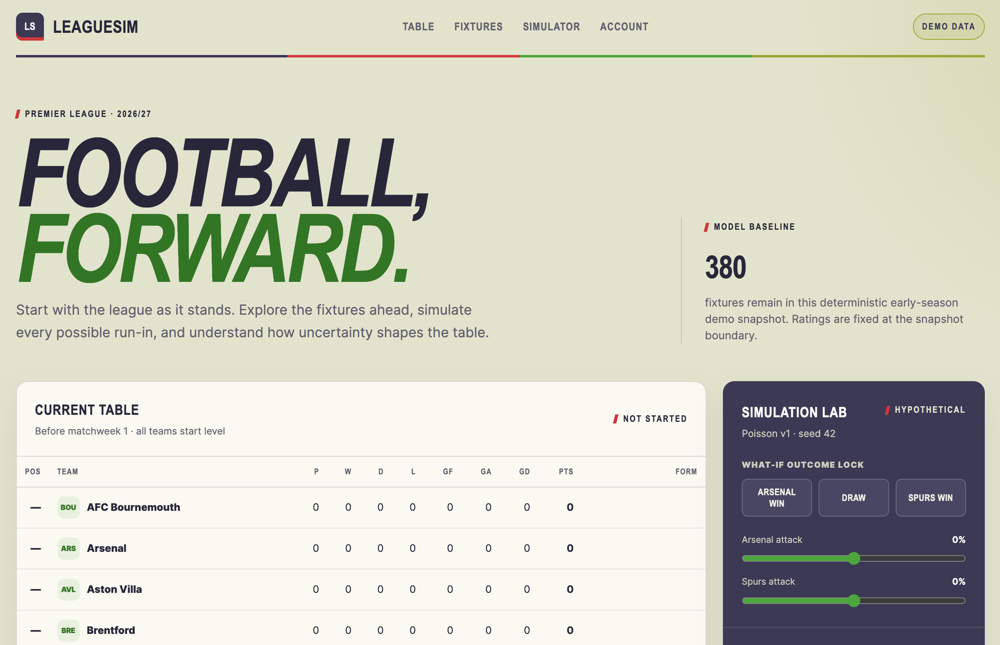

# LeagueSim

LeagueSim is a football analytics and season-simulation platform. It separates confirmed football data from hypothetical outcomes, calculates standings internally, samples matches from an explainable Poisson model, and aggregates thousands of possible seasons.

The repository currently ships with a deterministic, clearly labelled 20-team Premier League demo snapshot. A football-data.org v4 adapter and production PostgreSQL/Redis schema are included; external credentials are optional for local development.



## Features

- Responsive Premier League table with form and season-aware team pages
- Complete deterministic demo schedule beginning before matchweek 1
- Explainable home/away attack and defence ratings
- Seeded single-match and full-season simulation
- Monte Carlo title, top-four, top-six, relegation, points, and position distributions
- Exact-score and conditional-outcome what-if primitives
- Provider abstraction with runtime Zod validation
- Pure simulation package reusable from Next.js, tests, CLI, or BullMQ worker
- PostgreSQL/Prisma persistence model and Docker services

## Stack

Next.js 16, React 19, TypeScript, Tailwind CSS, TanStack Query, Zustand, Zod, PostgreSQL, Prisma, Redis, BullMQ, Vitest, Testing Library, Playwright, and Biome.

## Local setup

```bash
corepack enable
pnpm install
cp .env.example .env
cp .env.example apps/web/.env.local
docker compose up -d
pnpm db:setup
pnpm dev
```

Open `http://localhost:3000`.

- `DATABASE_URL` must be present in both `.env` (Prisma CLI) and `apps/web/.env.local` (Next.js).
- Docker Postgres uses host port **5433** to avoid clashing with a local Postgres on 5432.
- Browsing and simulation work without Docker using in-memory demo data.
- With Postgres running and `pnpm db:setup`, season simulations and Monte Carlo batches are persisted. Sign in to save named scenarios and reopen them from Account. Team pages accept `?batchId=` to show projected points, form, and results.
- The header shows **Signed in · your name** when authentication succeeds.

To use provider ingestion, register one football-data.org application, set `FOOTBALL_DATA_API_TOKEN`, and set `FOOTBALL_DATA_MODE=provider`. The ingestion persistence commands remain intentionally separate from application startup so a missing provider cannot corrupt or block demo operation.

## Quality commands

```bash
pnpm typecheck
pnpm test
pnpm build
pnpm test:e2e
```

## Deployment

- Web: Vercel
- PostgreSQL: Neon
- Redis: Upstash Redis using its TLS Redis URL
- Worker: Fly.io using `fly.worker.toml`

Only 10,000-run or measured-slow batches should move to the worker. Small simulations intentionally stay in-process until profiling supports moving them.

## Data and model disclaimer

Simulated demo scores are synthetic. Provider-backed pages must display `Data provided by football-data.org` and a retrieval timestamp. Club marks are not included because API access does not itself grant trademark rights.

**LeagueSim simulations are statistical hypothetical scenarios and should not be interpreted as guaranteed forecasts or betting advice.**

The initial model uses independent Poisson goal distributions. Ratings are smoothed toward a league prior, recent form has a deliberately small capped influence, and ratings stay fixed throughout a simulated season. See [DECISIONS.md](./DECISIONS.md) for the exact choices and limitations.
